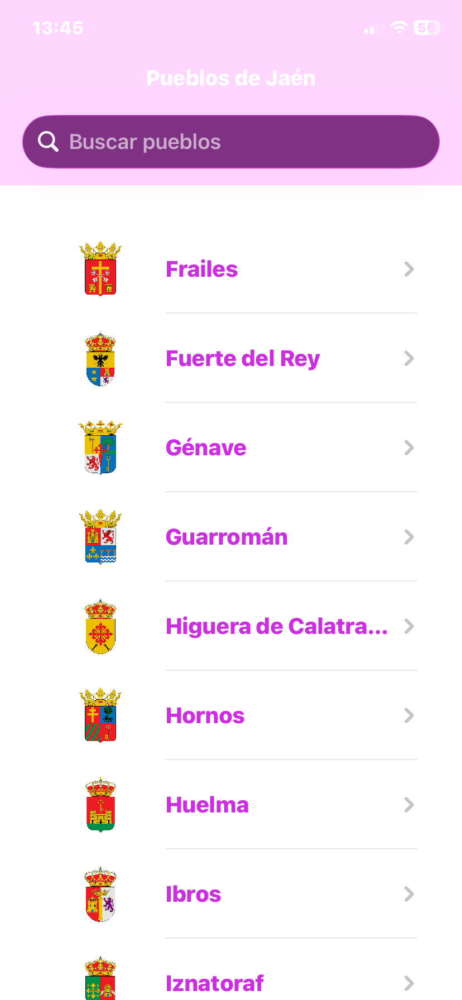
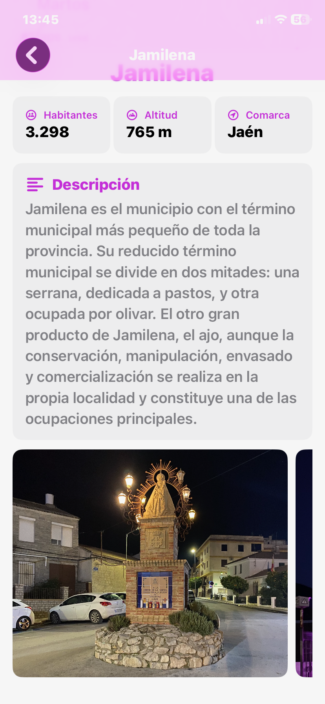

# appPueblosJaen — Guía de pueblos de Jaén (iOS)

Una app para descubrir los pueblos de la provincia de Jaén: su ubicación en el mapa, datos clave y fotografías de sus lugares más representativos.

## Resumen en 1 minuto
- Muestra un listado de pueblos de Jaén y permite ver el detalle de cada uno.
- En el detalle se ve un mapa, datos (habitantes, altitud, comarca), descripción y fotos.
- Los datos se descargan de un servicio online (Supabase) de forma segura y eficiente.
- La interfaz está hecha con SwiftUI y el mapa con MapKit.

## Capturas
- 
- 
- 

## Funcionalidades principales
- Listado de pueblos con carga remota.
- Pantalla de detalle con:
  - Mapa interactivo con la ubicación del pueblo.
  - Datos clave (habitantes, altitud, comarca).
  - Descripción.
  - Carrusel de fotos de sus lugares importantes.
- Carga eficiente y en paralelo de fotos de todos los lugares del pueblo.
- Manejo de errores y estados de carga para una experiencia robusta.

## Por qué es un proyecto profesional
- Arquitectura clara (MVVM + Repository + DataSource) que separa interfaz, lógica y datos.
- Código moderno en Swift con concurrencia (async/await) y tipado seguro (Codable).
- Test para asegurar el buen funcionamiento de la app.
- Navegación por la app con caja de estados.
- Red modular y reutilizable (peticiones, errores, endpoints separados).
- Diseño cuidado con SwiftUI, colores del sistema y componentes reutilizables.
- Pensado para crecer: añadir nuevas pantallas o fuentes de datos es sencillo.

## Cómo probar la app (paso a paso)
1. Requisitos
   - macOS con Xcode 15 o superior.
   - iOS 17 o superior en simulador o dispositivo.
2. Clona el repositorio
   git clone https://github.com/PabloPeragon/appPueblosJaen
   cd appPueblosJaen
